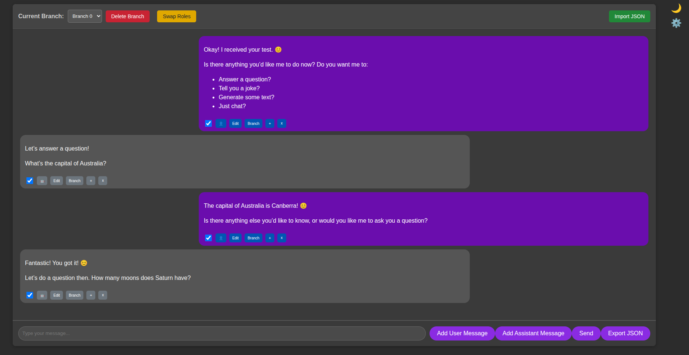

# LLM Web Chat

This is a simple web-based chat application that allows users to interact with a Large Language Model (LLM) through a web interface. The backend is built with Node.js and Express, and it communicates with a local LLM using the OpenAI API client.



## Features

-   **Interactive Chat Interface**: A clean and simple web UI for sending messages and receiving responses.
-   **Markdown Rendering**: Messages are rendered as HTML using `marked`, allowing for formatted text, code blocks, and more.
-   **Branching Conversations**: Create new conversation branches from any message, allowing exploration of different conversational paths.
-   **Selectable Message History**: Each message has a checkbox, allowing users to include or exclude it from the history sent to the LLM.
-   **Editable and Deletable Messages**: Messages can be edited or deleted from the conversation history.
-   **Dark Mode Toggle**: Switch between light and dark themes for comfortable viewing.
-   **Backend Integration**: Node.js/Express backend to handle API requests and communicate with the LLM.
-   **Local LLM Support**: Configured to connect to a local LLM instance compatible with the OpenAI API.

## Installation

To set up the project locally, follow these steps:

1.  **Clone the repository** (if applicable):
    ```bash
    git clone <repository-url>
    cd llm-webchat
    ```

2.  **Install dependencies**:
    Navigate to the project root directory and install the necessary Node.js packages:
    ```bash
    npm install
    ```

3.  **Local LLM Setup**: Ensure you have a local LLM running and accessible at `http://anon-ai.lan:9090/v1`. This application is configured to use this endpoint. Examples of local LLMs that can expose an OpenAI-compatible API include:
    -   [Ollama](https://ollama.ai/)
    -   [LM Studio](https://lmstudio.ai/)
    -   [LocalAI](https://localai.io/)

    Refer to your chosen LLM's documentation for instructions on how to set it up and expose an OpenAI-compatible API.

## Usage

To start the web chat application:

1.  **Start the server**:
    ```bash
    node index.js
    ```
    The server will typically start on `http://localhost:3000`.

2.  **Open in browser**:
    Open your web browser and navigate to `http://localhost:3000`.

3.  **Chat!**:
    Type your messages into the input field and press Enter or click the "Send" button to interact with the LLM.

## Markdown Rendering

This project uses the `marked` library to render Markdown content in chat messages. The backend exposes a `/render-markdown` endpoint that takes a Markdown string and returns the corresponding HTML. This allows for rich text formatting in the chat interface.

## Project Structure

-   `index.js`: The main backend server file, handling API routes and LLM communication.
-   `package.json`: Defines project metadata and dependencies.
-   `public/`: Contains static frontend files.
    -   `index.html`: The main HTML structure of the chat interface.
    -   `chat.js`: Frontend JavaScript for handling chat logic and API calls.
    -   `style.css`: CSS for styling the chat application.
